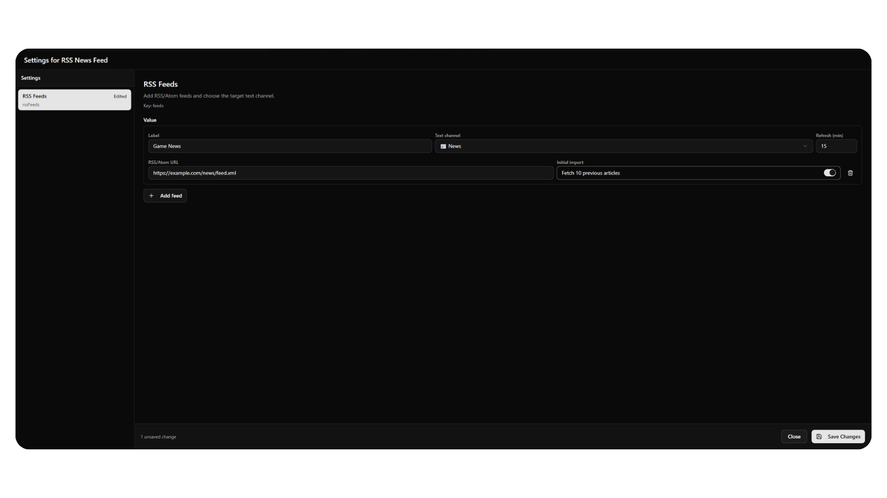
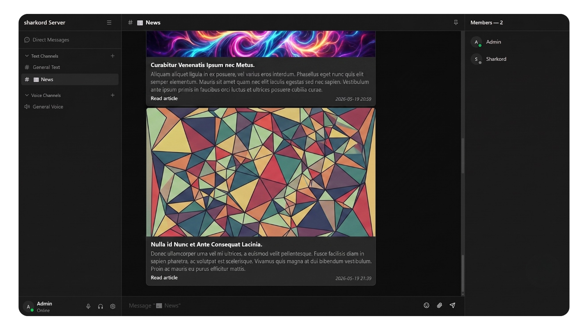

# 📰 Sharkord RSS

> Subscribe to RSS/Atom feeds and auto-post new articles to your Sharkord text channels.

<picture>
  <source media="(prefers-color-scheme: dark)" srcset="docs/banner-dark.png">
  
</picture>

---

## ✨ Features

- 🛠️ **Admin-only config** — managed from the plugin settings dialog (`MANAGE_PLUGINS`), no extra UI for regular members
- 🌐 **Public feeds only** — `localhost`, loopback, link-local & private IPs are blocked
- 🔒 **DNS-rebinding protection** + 10 s timeout + 5 MB body cap + 5 redirect hops
- 🧠 **Smart deduplication** — articles are never re-posted within a plugin session
- 🌱 **One-shot bootstrap** — optionally post up to 10 existing articles when a feed is first added
- ♻️ **Per-feed exponential backoff** (max 6 h) — one broken feed never blocks the others
- 🖼️ **Rich link previews** — posts a clean title + date + link; Sharkord's native preview renders the image/description card

---

## 📦 Install

🛒 **From the Sharkord marketplace** — install in one click from **Extensions → Marketplace**.

🗂️ **Manual install** — grab the latest `.tar.gz` from [Releases](https://github.com/EssekerDev/sharkord-rss/releases), unpack into your Sharkord plugin folder, and reload.

---

## ⚙️ Configuration

Feeds are configured by a **server administrator** only, from **Server Settings → Extensions → Sharkord RSS** (this page requires the `MANAGE_PLUGINS` permission).

### 1️⃣ Open the plugin settings

<picture>
  <source media="(prefers-color-scheme: dark)" srcset="docs/01-open-settings-dark.png">
  
</picture>

### 2️⃣ Find your channel IDs

Sharkord doesn't display channel IDs in its UI, but the app exposes its store on
the `window` object. Open your browser console (**F12 → Console**) while in your
server and paste this:

```js
window.__SHARKORD_STORE__.getState().channels
  .filter((c) => c.type === 'TEXT')
  .forEach((c) => console.log(c.id, '#' + c.name));
```

It prints each text channel's numeric ID next to its name — note the ID of the
channel you want articles posted to.

### 3️⃣ Paste your feeds

The **RSS feeds (JSON)** setting holds a JSON array of feeds. Paste a minimal
one-feed config to get started (replace `channelId` with yours):

```json
[{ "url": "https://hnrss.org/frontpage", "channelId": 2, "intervalMinutes": 15, "postOnBootstrap": false }]
```

| Field | Required | What it does |
|---|---|---|
| 🔗 `url` | yes | RSS or Atom feed URL (public `http`/`https` only) |
| 💬 `channelId` | yes | Numeric ID of the target text channel (from step 2) |
| ⏱️ `intervalMinutes` | no | Poll interval in minutes (defaults to 15, minimum 1) |
| 🌱 `postOnBootstrap` | no | Post up to 10 existing articles the first time the feed is added |

Add more feeds by appending objects to the array:

```json
[
  { "url": "https://hnrss.org/frontpage", "channelId": 2, "intervalMinutes": 15 },
  { "url": "https://www.lemonde.fr/rss/une.xml", "channelId": 3, "intervalMinutes": 30, "postOnBootstrap": true }
]
```

Invalid rows are skipped, so one bad entry never breaks the others. Save the setting and the plugin picks up the changes immediately.

### 4️⃣ Articles appear in the channel

<picture>
  <source media="(prefers-color-scheme: dark)" srcset="docs/03-news-card-dark.png">
  
</picture>

---

## 🛡️ Security

- ✅ Admin-only configuration (`MANAGE_PLUGINS`) — no plugin actions exposed to regular members
- ✅ Only public `http://` / `https://` URLs
- ✅ DNS pinned at connect time (no rebinding)
- ✅ 10 s timeout · 5 MB body cap · 5 redirect hops
- ✅ Messages use only sanitizer-safe HTML (`<p>`, `<strong>`, `<a>`), every dynamic value escaped
- ✅ Exact dependency pinning · no `eval` · no dynamic import

---

## 🧑‍💻 Local Development

```bash
git clone https://github.com/Sharkord/plugin-builder.git
cd plugin-builder
bun install
bun link

cd ../sharkord-rss
bun install
bun link @sharkord/plugin-builder
bun run build
```

The bundled plugin lands in `dist/sharkord-rss`.

---

## 📜 License

MIT © **Esseker**
