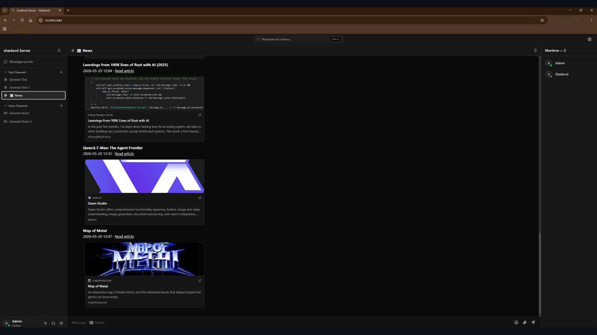

# 📰 Sharkord RSS

> Subscribe to RSS/Atom feeds and auto-post new articles to your [Sharkord](https://github.com/Sharkord/sharkord) text channels.

**Requires Sharkord plugin SDK v2** (Sharkord 0.0.25+). Version 0.1.1 targeted SDK v1 and will not load on current servers.

<picture>
  <source media="(prefers-color-scheme: dark)" srcset="docs/banner-dark.png">
  
</picture>

---

## ✨ Features

- 🛠️ **Admin Feeds tab** — add, edit and remove feeds from the plugin page, with a text-channel picker (no more hunting IDs in the browser console)
- 🧾 **JSON fallback** — the original setting is still there for power users and for configs that already existed on 0.1.x
- 🌐 **Public feeds only** — `localhost`, loopback, link-local, CGN and private IPs are blocked
- 🔒 **DNS-rebinding protection** + 10 s timeout + 5 MB body cap + 5 redirect hops
- 🧠 **Durable deduplication** — seen article IDs survive reloads in `plugin-data/` so a restart does not skip (or duplicate) items
- 🌱 **One-shot bootstrap** — optionally post up to 10 existing articles when a feed is first added
- ♻️ **Per-feed exponential backoff** (max 6 h) — one broken feed never blocks the others
- 🖼️ **Rich link previews** — posts a clean title + date + link; Sharkord's native preview renders the image/description card

---

## 📦 Install / update

### From the marketplace

Once **0.2.0** is listed, install or update it from **Extensions → Marketplace**. Servers on SDK v2 only offer versions whose `sdkVersion` is 2, so 0.1.1 will no longer appear.

Until the registry PR is merged, install the GitHub release manually:

1. Download `sharkord-rss-0.2.0.tar.gz` from [Releases](https://github.com/EssekerDev/sharkord-rss/releases).
2. Unpack it into your Sharkord plugins folder as `sharkord-rss/` (the folder name must match the plugin id).
3. In **Server Settings → Extensions**, enable **Sharkord RSS**.

Existing 0.1.x feed JSON is kept. After the update, open the **Feeds** tab — your subscriptions should already be there.

### Manual layout

```
~/.config/sharkord/plugins/sharkord-rss/
  manifest.json
  server/index.js
  client/index.js
```

---

## ⚙️ Configuration

Feeds are managed by a **server administrator** (`MANAGE_PLUGINS`), from **Server Settings → Extensions → Sharkord RSS → Feeds**.

1. Click **New feed**.
2. Paste a public RSS/Atom URL.
3. Pick the text channel from the list.
4. Optionally enable **Post existing articles on first add** (up to 10 items, once).
5. Save. New articles are posted as they appear.



The JSON setting remains as a fallback. Each row looks like:

```json
[{ "url": "https://hnrss.org/frontpage", "channelId": 2, "intervalMinutes": 15, "postOnBootstrap": false }]
```

| Field | Required | What it does |
|---|---|---|
| 🔗 `url` | yes | RSS or Atom feed URL (public `http`/`https` only) |
| 💬 `channelId` | yes | Numeric ID of the target text channel |
| ⏱️ `intervalMinutes` | no | Poll interval in minutes (defaults to 15, minimum 1) |
| 🌱 `postOnBootstrap` | no | Post up to 10 existing articles the first time the feed is added |

Invalid rows are skipped, so one bad entry never breaks the others.

---

## 🔄 Migrating from 0.1.1 (SDK v1)

The error `Plugin SDK version 1 is not compatible with server SDK version 2` means the installed plugin still declares `sdkVersion: 1`. Sharkord refuses to load it on purpose.

What 0.2.0 changes:

| 0.1.1 (SDK 1) | 0.2.0 (SDK 2) |
|---|---|
| `"sdkVersion": 1` | `"sdkVersion": 2` |
| `ctx.data.getChannel()` | `ctx.channels.get()` + `ChannelType.TEXT` |
| `ctx.log` / `ctx.debug` / `ctx.error` | `ctx.logger.*` |
| In-memory seen-article set | Seen IDs stored under `ctx.dataPath` |
| JSON-only config | **Feeds** admin tab + JSON fallback |
| No `onUpgrade` | `onUpgrade` logs the version jump |

Feed settings live in the Sharkord database, so they survive the plugin folder being replaced. You do not need to re-enter URLs.

After installing 0.2.0, publish a GitHub release and open a PR on [Sharkord/plugins](https://github.com/Sharkord/plugins) so the marketplace offers the SDK 2 build. Until that lands, only a manual install unblocks users.

```bash
bun run publish
```

Then add `plugins/sharkord-rss/versions/0.2.0.json` from the release assets to the registry.

---

## 🛡️ Security

- ✅ Admin-only configuration (`MANAGE_PLUGINS`) — actions re-check `ctx.permissions.userCan` on every call
- ✅ Only public `http://` / `https://` URLs
- ✅ DNS pinned at connect time (no rebinding)
- ✅ 10 s timeout · 5 MB body cap · 5 redirect hops
- ✅ Messages use only sanitizer-safe inline HTML (`<strong>`, `<a>`, `<br>`), every dynamic value escaped
- ✅ Exact dependency pinning · no `eval` · no dynamic import

---

## 🧑‍💻 Local Development

```bash
git clone https://github.com/Sharkord/plugin-builder.git
cd plugin-builder && bun install && bun link

cd ../sharkord-rss
bun install
bun link @sharkord/plugin-builder
bun test
bun run build
```

The bundled plugin lands in `dist/sharkord-rss`. Point `SHARKORD_PLUGINS_PATH` at your server's `plugins/` folder to install on each build.

---

## 📜 License

MIT © **Esseker**
